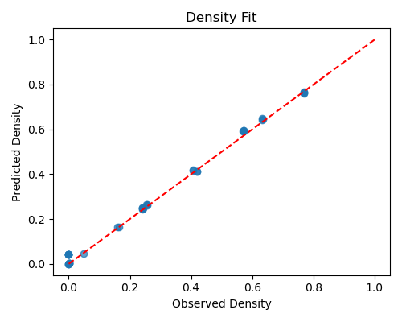

# 🧬 Probabilistic-Cellular-Automaton

**基于概率元胞自动机的细胞群体随机生灭与稳态统计分析**  
Monte Carlo simulation and nonlinear modeling of stochastic cell dynamics

---

## 📖 项目概述 | Overview

本仓库对应概率论期中论文《基于概率元胞自动机的细胞群体随机生灭与稳态统计分析》。  
研究通过蒙特卡洛方法与非线性回归建模，探讨了细胞群体在**随机出生–死亡机制**与**拥挤惩罚**下的统计稳态规律。

研究目标：
- 建立概率元胞自动机模型模拟群体演化；
- 研究不同参数下系统由灭绝态向稳定态的转变条件；
- 使用 PyTorch 非线性回归神经网络，拟合并解析存活概率与稳态密度公式。

---

## 🧩 项目结构 | Repository Structure
```
Probabilistic-Cellular-Automaton/
│
├── code/ ← 主程序（模拟与拟合）
│ ├── ProbCellularAutomaton_Simulation.py
│ ├── NonlinearGLM_Fitting.py
│
├── results/ ← 代表性参数组实验结果
│ ├── group1/ # 灭绝态
│ ├── group2/ # 稳态生存
│ ├── group5/ # 高稳态
│ ├── group9/ # 临界过渡态
│ 
│
├── figures/ ← 拟合结果图（神经网络模型）
│ ├── Figure_density_fit.png
│ ├── Figure_survival_fit.png
│ 
│
├── notes/ ← 实验记录与参数日志
│ ├── parameter_tests.md
│ ├── run_notes.md
│
├── paper/ ← 论文与摘要
│ └── 摘要.md
│
└── README.md ← 当前文件
```

---
## ⚙️ 环境依赖 | Environment

本项目基于 **Python 3.13** 与 **PyTorch 2.9.0 (CUDA 12.8)** 开发。  
程序依赖以下主要外部库：

| 库名称 | 版本（建议） | 用途说明 |
|:--------|:-------------|:----------|
| **torch** | 2.9.0+cu128 | 深度学习框架，用于神经网络回归拟合 |
| **torchvision** | ≥0.20 | PyTorch 生态支持（兼容性依赖） |
| **numpy** | ≥2.1 | 科学计算与数组运算 |
| **pandas** | ≥2.2 | 数据结构与表格操作 |
| **scipy** | ≥1.14 | 卷积、信号与统计计算 |
| **scikit-learn** | ≥1.6 | 标准化、指标计算与拟合评估 |
| **matplotlib** | ≥3.9 | 图表绘制与动画生成 |
| **seaborn** | ≥0.13 | 统计可视化与配色优化 |
| **tqdm** | ≥4.66 | 模拟与训练进度条显示 |

---

### 🧩 环境安装 | Installation

推荐在虚拟环境中安装依赖（例如 `venv` 或 `conda`）：

#### 🧱 1️⃣ 安装 PyTorch（CUDA 12.8 版本）

若仅使用 CPU，可跳过此部分

```
pip3 install torch torchvision --index-url https://download.pytorch.org/whl/cu128
```


#### 🧱 2️⃣ 安装其余依赖

```
pip install -r requirements.txt
```


## 🚀 运行说明 | How to Run

运行主模拟程序：
```
python code/ProbCellularAutomaton_Simulation.py
```
运行非线性回归拟合：
```
python code/NonlinearGLM_Fitting.py
```
## ⚙️ 参数设置 | Parameter Configuration

所有可修改参数集中在源码main()部分，可直接在文件中编辑：  


```python
ProbCellularAutomaton_Simulation.py

# ---------- 参数（如需调整请在这里改） ----------
N_GRID = 100              # 网格边长（系统规模为 N_GRID × N_GRID）
R_RUNS = 200              # 每组参数重复随机模拟次数
T_MAX_STEPS = 100         # 每次模拟的最大时间步数

P_BIRTH = 0.7             # 单位出生概率
P_DEATH_BASE = 0.3        # 基础死亡概率
ALPHA = 2.0               # 拥挤惩罚强度系数（越大惩罚越强）
N_BIRTH_MAX = 6           # 允许繁殖的最大邻域内个体数
N_DEATH_MIN = 3           # 邻域内触发拥挤惩罚的最小个体数

FORCE_RERUN = True        # 是否强制重新运行（True 会覆盖已有 CSV）
```
```python
NonlinearGLM_Fitting.py

# ==============================================================
# 🧩 用户自定义配置区 —— 直接在此修改
# ==============================================================

USE_GPU = True             # 是否使用 GPU（如果可用）
EPOCHS = 400               # 训练轮数（用于神经网络拟合）
LEARNING_RATE = 1e-2       # 学习率
BATCH_SIZE = 32            # 批大小（一次训练读取的数据量）
RESULTS_ROOT = "./results" # 输出结果文件夹路径

# 二选一（只需修改一个）
TOP_K = 13                 # 保留前 K 个重要特征（设为 None 禁用）
THRESHOLD = None           # 按重要性比例筛选特征（如 0.15，None 禁用）

# ==============================================================
```
修改后，ProbCellularAutomaton_Simulation.py会根据新参数进行模拟并绘图，并在根目录保存输出的各个文件，若想通过NonlinearGLM_Fitting.py进行拟合，请将各组信息以
```
根目录/results
│ ├── group1/ 
│ ├── group2/ 
│ ├── group3/ 
│ ├── groupn/ 
```
的形式进行整理存储，并在groupn下放置记录超参数的params.json

```json
params.json

{
  "P_birth": 0.7,
  "P_death_base": 0.3,
  "alpha": 4.0,
  "N_birth_max": 3,
  "N_death_min": 5,
  "T_MAX_STEPS":200,
  "note": "p=0.95发生反常行为，收敛值降低，推测是初始高密度惩罚概率导致系统进入灭绝态"
}

```
注:note仅供自行标注使用，可忽略
程序将会进行拟合并将非线性拟合模型结果汇总为`fit_formula_summary.md`并储存在根目录

## 📊 模拟结果 | Representative Results

本研究选择了四组典型参数组（共 13 组中的代表性样本）以展示系统相变特征：

| Group       | 描述    | 参数简述                          | 稳态行为            |
| :---------- | :---- | :---------------------------- | :-------------- |
| **Group 1** | 灭绝态   | P_birth=0.4, P_death=0.6, α=4 | 密度迅速衰减至零        |
| **Group 2** | 稳态生存  | P_birth=0.7, P_death=0.3, α=4 | 稳定中等密度 (~0.4)   |
| **Group 5** | 高稳态   | P_birth=0.5, P_death=0.5, α=0 | 高密度稳定生存 (~0.76) |
| **Group 9** | 临界过渡态 | P_birth=0.6, P_death=0.4, α=2 | 低密度稳态 (~0.24)   |

完整结果（13 组，约 1.2GB）无法上传，可私信作者提供。
## 📈 模型拟合结果 | Model Fitting Results

利用 PyTorch 实现的显式非线性回归神经网络，对模拟样本的统计结果进行多参数拟合。
下图展示模型在稳态密度与存活概率预测上的拟合效果：




**模型性能:**
- 验证集 R² (Survival): 0.9888
- 验证集 R² (Density): 0.9959
- 验证集 MSE (Survival): 0.002279
- 验证集 MSE (Density): 0.000301

## 🧮 实验参数记录 | Notes

13组实验运行参数已整理于 /notes/ 文件夹中，预计可以复现结果

## 📘 论文与摘要 | Paper

摘要文件存放于：
```
/paper/
└── 摘要.md
```
完整论文暂不在此提供，可私信作者

## 🧠 致谢 | Acknowledgments

本研究结合了概率论、数理统计与计算模拟方法，用于刻画随机系统在生灭机制下的稳态行为与相变规律。

感谢本人室友[@meteor-shower-l](https://github.com/meteor-shower-l)提供的灵感来源

感谢Gemini提供的实现思路

感谢ChatGPT提供的技术指导

感谢豆包提供的复杂LateX公式校正

感谢腾讯元宝提供的审查与修改建议

## 📚 最后

本项目以概率论与数理统计为理论基础，结合蒙特卡洛模拟与神经网络建模，  
旨在刻画复杂随机系统的稳态行为与相变规律。  
项目全部代码、数据与结果均可复现，欢迎参考或改进。

---

© 2025 作者：[EXSEDXC](https://github.com/EXSEDXC)  
仅供学术研究与教学用途。

---


## 🧠 未来工作与反馈


本项目仍处于探索阶段，主要面向课程研究与学生科研训练。  
未来将尝试以下改进方向：  
- 引入更多空间异质性与邻域结构变化；  
- 优化蒙特卡洛采样策略，提高收敛速度；  
- 进一步分析神经网络拟合的稳定性与泛化误差。

如果你是一名来自人工智能、计算机、自动化或相关工科专业的学生，  
希望进行算法实现、数值实验等方面的技术交流，  
或只是想一起讨论模型思路，也非常欢迎 😄。  

你可以通过 [Discussions] 或 [Issues]进行交流、提出建议、复现实验或分享结果。  
本人水平有限，但十分乐意与大家共同探讨 🤝。  
任何建设性的反馈都将被认真记录并感谢。 😊


## 📄 License

This project is licensed under the **Apache License 2.0**.  
You may use, distribute, and modify this project under the terms of the license,  
provided that proper credit is given to the original author and that the license notice is included in all copies or derivative works.

> © 2025 [EXSEDXC](https://github.com/EXSEDXC)  
> Licensed under the Apache License, Version 2.0 (the "License");  
> you may not use this file except in compliance with the License.  
> You may obtain a copy of the License at:  
> [http://www.apache.org/licenses/LICENSE-2.0](http://www.apache.org/licenses/LICENSE-2.0)

Unless required by applicable law or agreed to in writing, software distributed under the License is distributed on an "AS IS" BASIS,  
WITHOUT WARRANTIES OR CONDITIONS OF ANY KIND, either express or implied.  
See the License for the specific language governing permissions and limitations under the License.